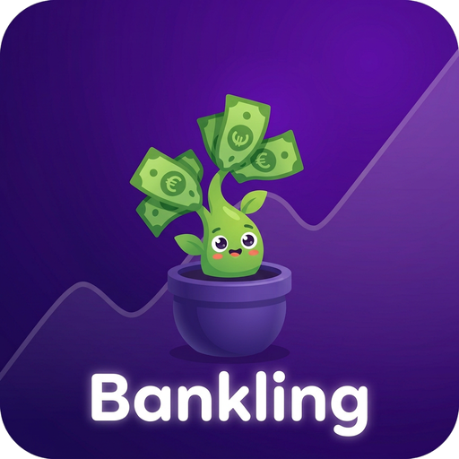

# 🪴 Bankling

**L'app qui prend ton argent très au sérieux.**

*Le seul gestionnaire de finances dont la mascotte est une plante dont les feuilles sont des billets.*

---

## 🌱 C'est quoi, ce truc ?

Bankling est une **PWA de gestion de finances personnelles** qui répond à la question que toute l'humanité se pose depuis des millénaires : *"où est-ce que mon argent est passé, exactement ?"*

Ici, pas de banque, pas de compte, pas de serveur : tout se passe **sur ton appareil**, dans ton navigateur. Tu crées tes propres portefeuilles — *« Mon PayPal 🅿️ », « Livret A 🏦 », « La cachette sous le matelas 🛏️ »* — avec le nom et l'emoji que **TU** veux. Fini les wallets imposés. C'est tes sous, c'est tes règles.

Et au-dessus de tout ça, il y a **Bling** 🌱, ta conseillère financière qui ne parle pas : une petite plante kawaii dont les feuilles sont des billets. Plus tu épargnes, plus elle a l'air contente. (Elle est toujours contente. Elle ne juge pas. Elle est en feuilles.)

## ✨ Ce qu'il y a dedans

- 👛 **Wallets libres** — autant que tu veux, nom + emoji à ta sauce, solde global en un coup d'œil
- 📊 **Graphique paramétrable** — argent/jour ou argent/transaction, de 7 jours à 1 an, intervalles personnalisés, wallet seul ou tous réunis, tooltip au survol, export PNG
- 🎁 **Le Wrapped** — ton bilan sur une période : dépensé, reçu, moyennes, jour le plus dépensier, top catégories… et surtout la fameuse **recherche approximative** : tape « bus », il te sort « bus 12 », « BUS », « abonnement bus » et même « BZS 12 » (un jour, quelqu'un avait tapé avec les doigts)
- 🏷️ **Catégories** — transport 🚌, courses 🛒, restaurants 🍔… et les tiennes en plus, directement dans l'onglet du wallet (montant → intitulé → catégorie → OK, jamais l'inverse)
- 🧾 **Historique complet** — recherche floue, filtres par type/catégorie/wallet, groupement par jour, suppression d'une opération avec solde recalculé
- 💶 **Mini-stats** — dépensé/reçu ce mois-ci et total de tous les wallets, sans même scroller
- 🎨 **8 palettes** de couleurs, de la plus sérieuse (Noir & blanc) à la plus « regarde mes économies » (Sarcelle)
- 💾 **Export/import JSON** — sauvegarde, transfert de téléphone en téléphone, choix fusion ou remplacement
- 📴 **100 % hors-ligne** — PWA installable, service worker, zéro internet après la première visite
- 🕰️ **Migration d'ancienne version** — notre fierté, voir ci-dessous

## 🕰️ L'assistant d'import de l'ancienne version

Tu viens de l'ancienne app (celle où tu étais *obligé* d'avoir exactement trois wallets : Carte Bleue, Espèces, PayPal) ? Pas de panique.

Bankling détecte ton vieux JSON et te demande, pour chaque ancien portefeuille : *« où veux-tu mettre mes valeurs ? »* Tu choisis un wallet existant — ou tu en crées un nouveau, avec **TON** nom et **TON** emoji. Les montants et l'historique sont conservés ; c'est juste les étiquettes qu'on change. La « Carte Bleue » atterrit dans « Mon PayPal 🅿️ » ? Aucun problème. Personne ne vient vérifier. C'est des données, pas un contrôle d'identité.

(La migration fonctionne aussi toute seule si d'anciennes données traînent encore dans le navigateur. On est prévoyants. 🤓)

## 🔒 Vie privée, niveau bunker

Pas de compte. Pas de serveur. Pas de trace. Tout vit dans le `localStorage` de **ton** navigateur (clé `bankling_v4`) — tes finances ne s'envolent nulle part, même pas en mode avion.

Seule exception, assumée : **toi** et ton cerveau. L'app ne peut rien pour toi face à l'achat impulsif de chaussures. *« C'est pas une dépense, c'est un investissement émotionnel »* — non, Bling a vu. 🌱

## 🤖 Fait 100 % à l'IA

Ce projet a été **entièrement généré par IA** — le code, le design, le logo (Bling, la plante-à-billets), les 8 palettes, le graphique maison, la recherche approximative, les 57 tests automatisés, et les jeux de mots (même ceux qu'on a écartés, ils existent quelque part). Aucun humain n'a touché une ligne de code. Des billets, oui. Du code, non. 🪴✨

---

*Bankling fait pousser ton argent. Le reste, c'est entre toi et Bling.* 🌱

